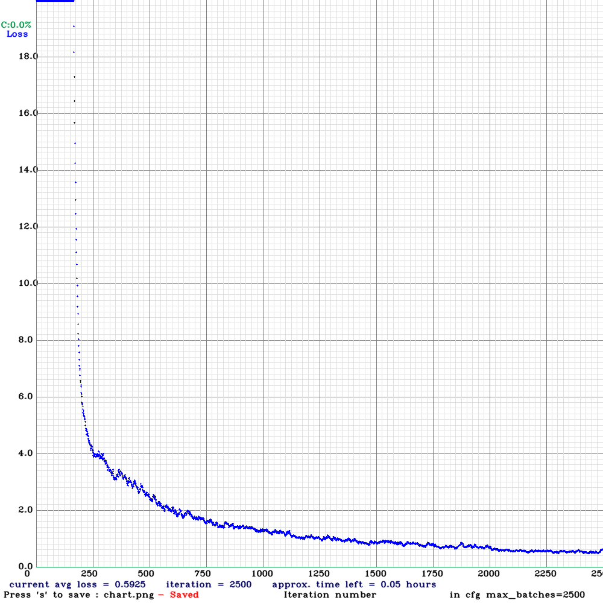

# FaceMaskDetection
Side Project For Face Mask Detection
## 資料來源
本資料集由伊甸數位庇護工廠於2020年疫情剛興起時所製作提供

- [人臉口罩偵測資料集](https://github.com/ch-tseng/Dataset_for_Mask_Wearing.git)

## 操作

本專案資料夾產生方式

1. 依照[https://github.com/AlexeyAB/darknet](https://github.com/AlexeyAB/darknet)指引安裝YOLO
2. 下載資料集 
3. 使用VOC_covert_to_yolo.py 將資料集xml轉換成yolo格式的txt、切分資料

本專案資料夾會與darknet同目錄

本專案採用
yolov4-tiny-29

cfg調整
本資料集class為3(good,bad,none)

filter=(class+5)*3=24

本實驗使用顯示卡為GTX 1050
故，batch調整為64,subdivisions=16

max_batches=class*2000，但本資料集過於簡單，故調整成2500

steps調整成max_batches的80%,90%

訓練
```commandline
cd darknet
```
```commandline
darknet detector train ../Dataset_for_Mask_Wearing/cfg/face.data ../Dataset_for_Mask_Wearing/cfg/yolov4-tiny-obj.cfg ../Dataset_for_Mask_Wearing/cfg/yolov4-tiny.conv.29 -dont_show
```



測試
記得cfg的batch與subdivisions調成1

```commandline
darknet detector test ../Dataset_for_Mask_Wearing/cfg/face.data ../Dataset_for_Mask_Wearing/cfg/yolov4-tiny-obj.cfg ../Dataset_for_Mask_Wearing/cfg/weights/yolov4-tiny-obj_final.weights ../Dataset_for_Mask_Wearing/cfg/DEMO2.jpg
```


以DEMO2產生的結果


## 參考網站
- [AlexeyAB/darknet](https://github.com/AlexeyAB/darknet)

- [YOLOv4 訓練教學](https://medium.com/ching-i/yolo-c49f70241aa7)